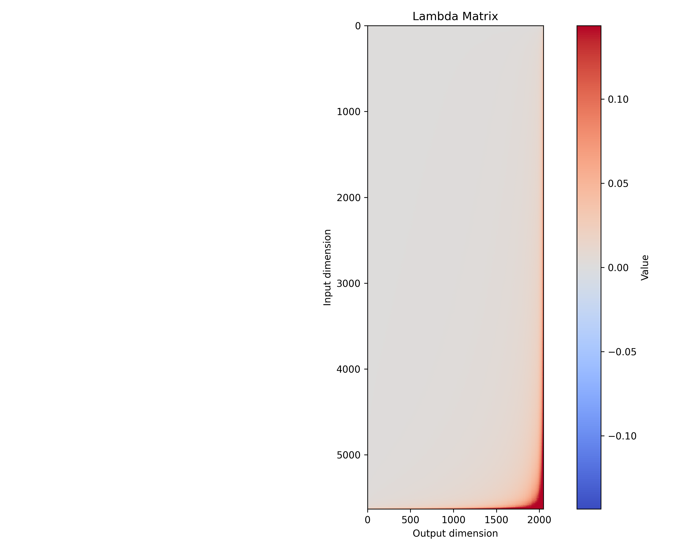
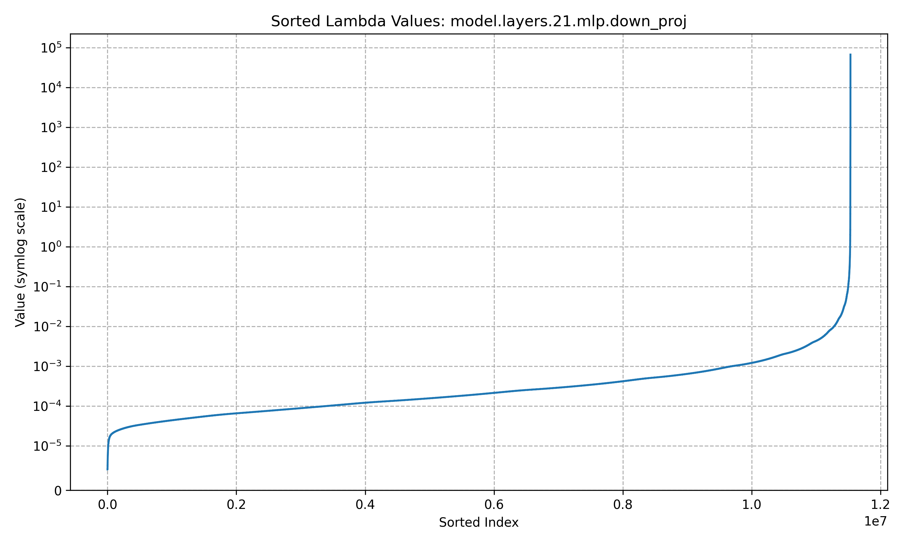

# Training Process Overview

## Fine-tuning for Training Data Attribution

We use fine-tuning for training data attribution because it allows us to directly measure
how specific training examples influence the model's predictions.
By fine-tuning a pre-trained model on our dataset, we can track the gradient information and influence factors
that connect individual training examples to the model's behavior.
This approach enables us to attribute model outputs to specific training inputs,
providing transparency into which examples had the most significant impact on particular predictions.

## Key Hyperparameters and Their Significance

When fine-tuning a language model for data attribution, several hyperparameters significantly affect training efficiency and the quality of attribution analysis:

- **Learning rate**: Controls how quickly the model adapts to new data. Too high may cause instability, too low may result in slow convergence.
- **Batch size**: Affects memory usage and training speed. Larger batches provide more stable gradients but require more memory.
- **Number of epochs**: Determines how many times the model sees the entire dataset.
- **Weight decay**: Regularization technique to prevent overfitting by penalizing large weights.
- **Gradient accumulation**: Allows for effective larger batch sizes by accumulating gradients over multiple forward passes.

## Training Metrics

During training, we primarily monitor **loss values**, which indicate how well the model is learning from the data.
A decreasing loss suggests the model is improving its predictions.
For language models, we typically use cross-entropy loss, which measures the difference between predicted token probabilities and actual tokens.

We also track:

- **Learning rate changes** (especially with schedulers like cosine with restarts)
- **GPU memory usage** to ensure efficient resource utilization
- **Training speed** (samples processed per second)

## Train-Test Split

The dataset is divided into training and testing portions to ensure the model can generalize to unseen data.
Based on our configuration, we use approximately 16,000 samples from the patent classification dataset, and another 7000 samples for evaluation.
This split helps us verify that the model isn't simply memorizing the training data but learning generalizable patterns.

## Data Preparation and Cleaning

For our patent classification dataset, data preparation includes:

1. **Text normalization**: Standardizing text format, case, and special characters
2. **Tokenization**: Converting raw text into tokens the model can process
3. **Length adjustment**: Truncating or padding sequences
4. **Format conversion**: Structuring data into question-answer format for the model

## Training Time and Resources

Training our TinyLlama model took approximately 20 minutes on an NVIDIA A100 GPU. This relatively short training time is achieved through careful optimization of training parameters and taking advantage of the GPU's capabilities.

## Training Configuration Parameters

Our `config.yaml` includes several parameters specifically optimized for training speed and GPU utilization:

```yaml
models:
  base:
    name: "TinyLlama/TinyLlama-1.1B-intermediate-step-1431k-3T"
    id: "base_tinyllama"
  finetuned:
    path: "./tinyllama_1b_model"
    id: "finetuned_tinyllama"

general:
  max_length: 512
  use_flash_attention: false

dataset:
  num_samples: 16000
  format: "qa"
  input_column: "Input"
  output_column: "Output"
```

The TinyLlama model (1.1B parameters) was selected as it provides a good balance between capability and training speed. We set a reasonable max sequence length of 512 tokens to limit memory usage while still accommodating most patent descriptions.

## Training Arguments Explained

```python
training_args = TrainingArguments(
    output_dir=model_output_path,  # Directory where model checkpoints are saved
    num_train_epochs=1,  # Single epoch training is sufficient for our attribution analysis
    per_device_train_batch_size=8,  # 8 samples processed at once per GPU
    save_steps=100,  # Save a checkpoint every 100 steps
    logging_steps=20,  # Log metrics every 20 steps for monitoring
    learning_rate=2e-5,  # Conservative learning rate to avoid catastrophic forgetting
    weight_decay=0.01,  # Regularization to prevent overfitting
    logging_dir="./logs",  # Directory for storing logs
    lr_scheduler_type="cosine_with_restarts",  # Learning rate schedule that reduces LR over time with periodic resets
    gradient_accumulation_steps=1,  # No gradient accumulation, process each batch directly
    max_grad_norm=None if use_bf16 else 1.0,  # Disabled gradient clipping when using BF16 precision
    bf16=use_bf16,  # Use bfloat16 precision when available for faster training
    gradient_checkpointing=False,  # Disabled to improve speed since we have sufficient memory
    optim="adamw_torch_fused",  # Optimized implementation of AdamW for faster computation
    dataloader_num_workers=4,  # Parallel data loading with 4 workers
    ddp_find_unused_parameters=False,  # Optimization for distributed training
    dataloader_drop_last=True,  # Drop incomplete batches for consistent batch sizes
    remove_unused_columns=True,  # Memory optimization by removing unneeded columns
    report_to="wandb" if wandb.run is not None else None,  # Report metrics to Weights & Biases if configured
)
```

## Influence Factor Computation using Kronfluence

Once the model is fine-tuned, we need to understand how individual training examples influence its behavior. Ideally, we'd measure influence by seeing how much a test prediction changes if we remove a specific training example and retrain. This is computationally infeasible.

Influence functions provide a mathematical shortcut. Conceptually, the influence of a training example (`z_m`) on a test example (`z_c`) can be estimated as:

```
Influence ≈ (How test loss changes with model weights) * (Inverse of model sensitivity) * (How training loss changes with model weights)
```

Mathematically, this involves the gradients of the loss functions and the inverse of the Hessian matrix ($\mathcal{H}^{-1}$):

\[ \mathcal{I}_{\theta} (z_c, z_m) = - \nabla_{\theta} \mathcal{L}(z*c, \theta) \ \mathcal{H}^{-1} \ \nabla*{\theta} \mathcal{L}(z_m, \theta) \]

The **Hessian** ($\mathcal{H}$) measures the curvature or sensitivity of the model's training loss landscape. It tells us how the gradient itself changes as model weights change. The challenge is that for large models like TinyLlama (1.1B parameters), the Hessian is enormous (billions x billions matrix), making it impossible to compute and invert directly.

### EKFAC: Approximating the Inverse Hessian

We use the [Kronfluence library](https://github.com/pomonam/kronfluence), which employs the **Eigenvalue-corrected Kronecker-Factored Approximate Curvature (EKFAC)** method to approximate the crucial $\mathcal{H}^{-1}$ term efficiently [\[Gro23S\]](https://transferlab.ai/pills/2023/llm-influences-with-ekfac/).

1.  **Kronecker-Factored Approximation (K-FAC)**: This first step simplifies the problem by assuming gradients are independent across different layers and making further approximations within layers. This allows approximating the Hessian (specifically, the Fisher Information Matrix, which is equivalent for our loss function) with smaller, block-diagonal matrices based on Kronecker products. These smaller blocks are much easier to handle computationally [\[Mar15O\]](https://transferlab.ai/pills/2023/llm-influences-with-ekfac/).

2.  **Eigenvalue Correction (E)**: K-FAC's approximations can introduce errors. The "E" in EKFAC corrects for this by computing the eigenvalues (which represent the magnitude of curvature in different directions) of the K-FAC blocks and adjusting them to better match the eigenvalues of the true, full Hessian. This significantly improves the approximation's accuracy without needing the full Hessian [\[Geo18F\]](https://transferlab.ai/pills/2023/llm-influences-with-ekfac/).

### The `fit_all_factors` Process

The `modules/analysis/factors/compute.py` script orchestrates this using Kronfluence's `Analyzer`.

- **Task Definition (`LanguageModelingTask`)**: We define a `LanguageModelingTask` (from `modules/analysis/factors/task.py`). This tells Kronfluence how to calculate the loss for our specific model and which parts of the model (modules) are relevant for the influence analysis. Based on our `config.yaml`, we configure it to analyze the MLP components (`gate_proj`, `up_proj`, `down_proj`) of _all_ transformer layers.

- **Factor Computation**: The `analyzer.fit_all_factors` function iterates through a subset of the training data (`analysis_samples` = 16000 from `config.yaml`). For each batch, it calculates the EKFAC factors (the approximated $\mathcal{H}^{-1}$ information) for the specified MLP modules across all layers. Performance is optimized using settings in `config.yaml` (`factors.batch_size`, `factors.num_workers`, `factors.performance_options`) like parallel data loading, data partitioning, and mixed-precision computation (`bfloat16`).

**Output**: The process saves the computed EKFAC factors (e.g., `tinyllama_1b_factors_all_layers.pt`) in the `results/influence/factors/` directory. These factors represent the pre-computed approximation of the model's sensitivity (inverse Hessian) and are essential for the next step: calculating specific influence scores efficiently.

## Inspecting Influence Factors

After computing the EKFAC factors, it's useful to inspect them to understand their structure and what they tell us about the model's sensitivity. The `modules/analysis/factors/inspect.py` script handles this visualization.

**Purpose**: The main goal is to visualize the computed approximation of the model's sensitivity (specifically, the EKFAC representation of the inverse Hessian) for a particular layer. This helps us understand how well the EKFAC method captured the important directions of curvature in the loss landscape and reveals properties about the model's parameter space relevant to the task.

**Why Inspect a Specific Layer?**
We often focus on inspecting factors from a specific layer, typically one of the later layers (like layer 21, the default `inspection_layer` in our `config.yaml`). Deeper layers in a transformer often learn more abstract and task-specific representations, so their sensitivity patterns can be particularly informative about how the model handles the task (in our case, patent classification QA).

**How it Works**:
The script loads the pre-computed EKFAC factors (specifically the 'lambda matrix', which relates to the curvature) for the specified layer. It then calculates the _eigenvalues_ of this matrix. Eigenvalues represent the magnitude of sensitivity along different directions in the parameter space. Finally, it generates plots:

1.  A heatmap of the lambda matrix itself.
2.  A plot showing the distribution of eigenvalues (sorted from largest to smallest).
3.  A plot showing the cumulative variance explained by the eigenvalues.

**Interpreting the Results**:

- **Lambda Matrix Heatmap**: Shows the structure of the sensitivity approximation (related to the EKFAC factors) for a specific component (likely layer 21's MLP `down_proj` layer). The axes represent input and output feature dimensions for that layer. The color indicates the sensitivity value for interactions between specific input/output features.

  - **Interpretation**: The heatmap shows that most values are near zero (light grey), suggesting low sensitivity for many feature interactions within this layer. However, the stronger colors (red/blue) concentrated along the right and bottom edges indicate that the model's sensitivity is highly dependent on specific interactions involving higher-indexed input and output features of this layer. This structured, non-uniform pattern suggests the EKFAC approximation captures specific sensitivities rather than just noise, highlighting the feature interactions most critical to the model's curvature at this point.

  

- **Sorted Lambda Values Plot**: Another way to visualize the factor structure is to plot all the values from the lambda matrix for a specific module, sorted from smallest to largest. The plot below for layer 21's `down_proj` module uses a symmetric log scale (`symlog`) on the y-axis to handle positive and negative values near zero.

  - **Interpretation**: This plot clearly shows that a vast majority of the values in the lambda matrix for this layer component are extremely close to zero (near 10^-5 or smaller). Only a very small fraction of the values have significantly larger magnitudes, indicated by the sharp upward curve on the far right. This confirms the "sparse" nature of the sensitivity captured by the EKFAC factors for this layer.

  - This chart effectively displays the sensitivity or curvature calculated by the EKFAC method for this specific part of the model (`model.layers.21.mlp.down_proj`). Conceptually, this sensitivity relates to different "directions" within the model's vast space of possible settings (parameters). The horizontal axis represents these different sensitivity components sorted by magnitude, while the vertical axis (on a log scale) shows the sensitivity measure. The plot shows that for most components (the long flat part at the bottom), the model is not very sensitive; changes related to these components don't drastically affect its output curvature. However, there are a few components (the sharp upward curve on the right) where the model is extremely sensitive; changes related to these specific components significantly impact performance curvature. This information, especially the spread from very small to very large values, is crucial for the influence function calculations performed by Kronfluence, as it helps weigh how much impact individual training examples had on the final model by relating training data changes to these sensitive components.

  

## Influence Score Computation

Having computed and inspected the EKFAC factors (our approximation of model sensitivity, $\mathcal{H}^{-1}$), the next step is to calculate the actual influence scores. These scores quantify the impact of individual training data points on the model's behavior for specific queries or prompts we are interested in. The `modules/analysis/scores/compute.py` script manages this process.

**The Goal**: We want to estimate, for a given query (e.g., a specific prompt from `prompts.json`), which training examples were most influential (positively or negatively) on the model's output for that query.

**How it Works (Conceptually)**:
Recall the influence function formula:

\[ \mathcal{I}_{\theta} (z_c, z_m) \approx - \underbrace{\nabla_{\theta} \mathcal{L}(z*c, \theta)}*{\text{Query Gradient}} \ \underbrace{\mathcal{H}^{-1}}_{\text{Factors}} \ \underbrace{\nabla_{\theta} \mathcal{L}(z*m, \theta)}*{\text{Train Gradient}} \]

1.  **Load Factors**: The script first loads the pre-computed EKFAC factors (the $\mathcal{H}^{-1}$ approximation saved in the previous step, e.g., `tinyllama_1b_factors_all_layers.pt`).
2.  **Prepare Data**: It loads:
    - The **training dataset** (the same `analysis_samples` subset used for factor computation).
    - The **query dataset** (created from `prompts.json` or potentially from model-generated answers if specified).
3.  **Compute Gradients**: Using the fine-tuned model and the `LanguageModelingTask` (which defines how loss is calculated), Kronfluence computes:
    - The gradient of the loss for each **query example** ($\\nabla_{\theta} \mathcal{L}(z_c, \theta)$).
    - The gradient of the loss for each **training example** ($\\nabla_{\theta} \mathcal{L}(z_m, \theta)$).
4.  **Combine Components**: Kronfluence efficiently combines the query gradients, the loaded EKFAC factors, and the training gradients according to the formula to calculate the influence score for _every pair_ of query and training examples.

**Key Configuration (`config.yaml` Scores Section)**:

- `scores_name`: Name for the saved scores file (e.g., `tinyllama_prompt_scores`).
- `query_gradient_rank`: This allows using a low-rank approximation for the query gradients. A lower rank speeds up computation significantly, especially with many queries, at the cost of some precision. We use a rank of 64.
- `train_batch_size`: How many training example gradients are processed together (set to 4 for memory efficiency).

**Output**: The result is a large tensor (matrix) of influence scores, saved in the scores output directory (e.g., `results/influence/scores/tinyllama_prompt_scores.npz`). Each element `(i, j)` in this matrix represents the estimated influence of training example `j` on the model's loss for query example `i`. These scores are the key to understanding data attribution.

## Evaluating Model Performance and Influence

After fine-tuning and analyzing influence factors/scores, the final step is to evaluate the model's performance and understand how the training data influences specific outputs. Our pipeline uses two main evaluation approaches orchestrated by `main.py` when running the `evaluate --type all` command.

### 1. Custom Evaluation and Influence Analysis

This part focuses on comparing the fine-tuned model against the base model using our specific prompts and analyzing the influence scores related to these prompts.

- **Answer Generation**: The `modules.evaluation.custom.generate_model_answers` script takes the prompts defined in `prompts.json`, feeds them to both the base (`TinyLlama/...`) and the fine-tuned (`./tinyllama_1b_model`) models, and saves their generated answers (likely to `results/generated/`).
- **Comparison**: The `modules.evaluation.custom.compare_models` script then likely analyzes these generated answers. While not explicitly calculating metrics like ROUGE or BLEU in the current structure, this step is where such comparisons could be made to assess fluency, relevance, or correctness improvements in the fine-tuned model compared to the base model. It can also leverage the influence scores (computed specifically for generated answers using `scores.compute_scores --use_generated`) to correlate specific training examples with particular generated outputs or errors.

### 2. Standardized Benchmarking with DeepEval and MMLU

To gauge the model's capabilities on a broader, standardized set of tasks, we use the [DeepEval framework](https://docs.confident-ai.com/).

- **DeepEval**: An open-source library designed for evaluating Large Language Models (LLMs) across various metrics and benchmarks. It provides tools to assess aspects like reasoning, knowledge, and safety.
- **MMLU (Massive Multitask Language Understanding)**: A popular benchmark included within DeepEval. MMLU measures a model's knowledge across a diverse range of subjects, typically using multiple-choice questions. It aims to assess a model's ability to recall facts and reason across different domains.
- **Our Configuration (`config.yaml`)**: We configure `modules.evaluation.deepeval.deepeval_runner.py` to run the MMLU benchmark specifically on the fine-tuned model (`eval_finetuned_model: true`, `eval_base_model: false`). We selected specific MMLU tasks relevant to our patent/legal domain:
  - `PROFESSIONAL_LAW`
  - `BUSINESS_ETHICS`
  - `INTERNATIONAL_LAW`
    These tasks test the model's understanding in areas pertinent to patent classification and related legal/business concepts. The results are saved in `results/deepeval/`.
